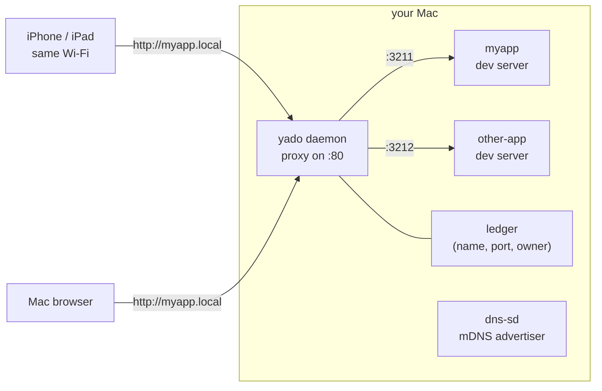

<p align="center">
  
</p>

<p align="center"><a href="README.md">日本語</a> | <b>English</b></p>

# yado

**Dev servers, checked in like guests.** yado starts your local dev server on an
automatically allocated free port and makes it reachable at
`http://<project>.local/` — from your Mac, your iPhone, and anything else on the
same Wi-Fi. No port numbers, no `EADDRINUSE`, no sudo.

## Why

Coding with AI agents broke `localhost:3000`.

One Claude Code session starts `bun run dev`, a Codex session in a worktree
starts another, and you have a third one running in your own terminal. They all
want port 3000. The best case is `EADDRINUSE`; the worst case is an agent
"helpfully" running `lsof -i :3000 | kill` and killing the server *you* were
using.
Meanwhile you can never remember whether the app on your phone was `:3000`,
`:3001`, or `:5173`.

The root cause is that ports are a shared resource with no arbiter. yado is
that arbiter: one shared entrance for humans and agents, a ledger of who is
running what, and stable names instead of ephemeral port numbers.

The name is a homage to [hotel](https://github.com/typicode/hotel), which got
this right years before AI agents made it urgent. *Yado* (宿) is Japanese for
an inn.

## What you get

- **Automatic free ports** — never think about port numbers again
- **`http://<project>.local/`** — stable names via mDNS (Bonjour), reachable
  from other devices on the same Wi-Fi. The URL survives restarts even when
  the port changes
- **Auto check-in** — plain `bun run dev` (or npm/pnpm) is detected and gets a
  `.local` name too. Muscle memory keeps working
- **Owner-aware stop** — `yado stop` refuses to touch servers started by
  someone else without confirmation. Agents no longer guess which server to
  stop
- **Agent-native** — ships as an [Agent Skill](https://skills.sh): Claude Code
  and Codex learn the rules automatically: reuse running servers, never kill
  processes directly, ask before stopping servers they don't own
- **Zero sudo, zero runtime deps** — just Bun and macOS built-ins

## Quick start

Requirements: macOS, [Bun](https://bun.sh) ≥ 1.2.

```bash
# for AI agents (Claude Code, Codex, Cursor, ...) — installs the skill
npx skills add y-migita/yado

# for yourself — put the CLI on your PATH
git clone https://github.com/y-migita/yado.git && cd yado && bun link
```

Then, in any project:

```bash
yado
# yado ▸ http://myapp.local → :3211  (log: ~/.local/state/yado/logs/myapp.log)
```

Open `http://myapp.local/` on your Mac or your phone. That's it.

## Usage

```bash
yado                  # start: auto-detects bun/npm/pnpm and the "dev" script
yado -- vite --host   # start an explicit command instead
yado --name demo      # override the name (default: directory name)
yado ls               # what's running, where, and who owns it
yado stop [name]      # graceful stop (whole process group); asks if it's not yours
```

Servers started without yado are **auto-checked-in**: a daemon notices new
listeners in your projects directory, gives them a `.local` name, and tells you
in the terminal you started them from.

## How it works



- The CLI reserves a free port, starts your dev server with it, and registers
  the guest in the ledger. Output is teed to a log file agents can read.
- A daemon binds port 80 (no sudo needed on macOS) and proxies each
  `<name>.local` request — including WebSockets, so HMR works — to the right
  port.
- Each name is advertised over mDNS with the system `dns-sd` tool, so every
  Apple device (and most other modern devices) on the network resolves it. Nothing
  leaves your LAN; there is no tunnel and no external DNS.

## FAQ

**Can my phone really open `.local` URLs?**
iPhones, iPads, and Macs resolve mDNS natively. Modern Android does too.
These URLs will not resolve on networks that block multicast (including some
corporate and guest Wi-Fi) or over a VPN — yado is built for trusted
home/office networks.

**What about VR headsets (Quest)?**
For WebXR you need a secure context anyway; the practical route is
`adb reverse tcp:80 tcp:80`, then open `http://localhost/` on the headset.
Deeper VR integration is on the v2 list.

**Why HTTP only?**
For LAN dev viewing, HTTPS buys nothing except certificate pain on every
device. If you need a secure-context API on the phone, that's the one case
where yado won't help yet (also on the v2 list).

**Why macOS only?**
v1 leans on macOS guarantees: unprivileged port 80 and the built-in `dns-sd`.
Linux support (pure-JS mDNS) remains feasible by design.

## Prior art

[hotel](https://github.com/typicode/hotel) pioneered "dev servers behind local
domains" (unmaintained, no LAN access).
[localias](https://github.com/peterldowns/localias) does aliases + HTTPS + mDNS
very well as a standalone Go binary, but doesn't manage processes or ports.
[LocalCan](https://www.localcan.com/) is a polished commercial GUI.
[OrbStack](https://orbstack.dev/) solves this beautifully for containers.
yado's angle: port arbitration + names + an ownership ledger, designed for
workflows shared by humans and agents, and small enough to ship as a skill.

## License

[MIT](LICENSE)
