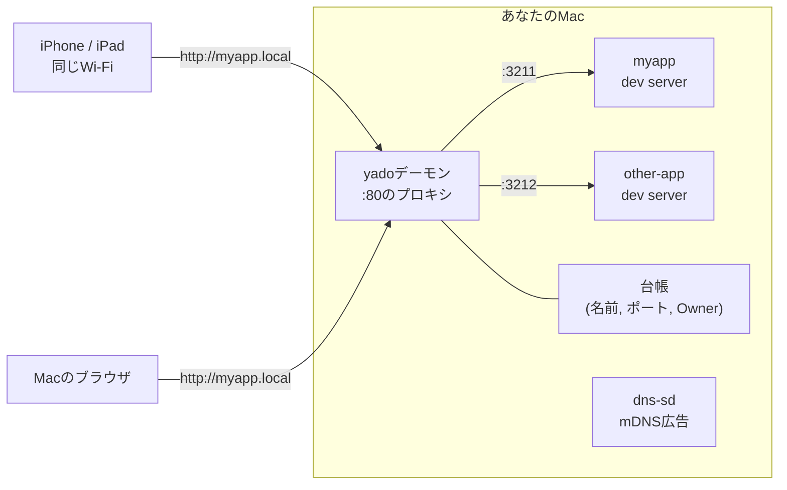

<p align="center">
  
</p>

<p align="center"><b>日本語</b> | <a href="README.en.md">English</a></p>

# yado

**dev serverを、宿のゲストのようにチェックイン。** yadoはローカルのdev serverを
空きポートで自動起動し、`http://<プロジェクト名>.local/` で開けるようにします。
Macからも、iPhoneからも、同じWi-Fiのどのデバイスからも。ポート番号の暗記も、
`EADDRINUSE`も、sudoも要りません。

## なぜ作ったか

AIエージェントとの開発は`localhost:3000`を壊しました。

Claude Codeのセッションが`bun run dev`を叩き、worktreeで動くCodexのセッションが
別のdev serverを立ち上げ、自分のターミナルでもさらに1つ動いている。全員が
3000番を取り合います。
ましなケースで`EADDRINUSE`、最悪のケースではエージェントが「親切に」
`lsof -i :3000 | kill`を実行して、あなたが使っていたサーバーを落とします。
そしてスマホで開いていたあのアプリが`:3000`だったか`:3001`だったか`:5173`
だったかは、誰も覚えていません。

根本原因は、ポートという共有資源に調停者がいないことです。yadoはその調停者に
なります。人間もエージェントも通る1つの入口、誰が何を動かしているかの台帳、
そして変わりやすいポート番号に代わる安定した名前です。

名前は、AIエージェントの普及でこの問題が切実になる何年も前に本質を捉えていた
[hotel](https://github.com/typicode/hotel)へのオマージュです。

## できること

- **空きポート自動割当** — ポート番号のことは二度と考えない
- **`http://<プロジェクト名>.local/`** — mDNS(Bonjour)による安定した名前。
  同じWi-Fiの他デバイスからも開け、再起動でポートが変わってもURLは同じ
- **自動チェックイン** — 素の`bun run dev`(npm/pnpmも)も検出して`.local`名が
  付く。手癖はそのままでいい
- **所有者を考慮した停止** — `yado stop`は他人が起動したサーバーを確認なしに
  触らない。エージェントの「推測してkill」がなくなる
- **エージェントネイティブ** — [Agent Skill](https://skills.sh)として配布。
  Claude CodeもCodexも、ルール(動いていれば再利用する、`kill`を直接実行
  しない、他人のサーバーは確認してから止める)を自動で覚える
- **sudoゼロ、ランタイム依存ゼロ** — 必要なのはBunとmacOS標準ツールだけ

## クイックスタート

必要環境: macOS、[Bun](https://bun.sh) 1.2以上。

```bash
# AIエージェント用(Claude Code, Codex, Cursor, ...) — スキルをインストール
npx skills add y-migita/yado

# 自分用 — CLIをPATHに通す
git clone https://github.com/y-migita/yado.git && cd yado && bun link
```

あとは任意のプロジェクトで:

```bash
yado
# yado ▸ http://myapp.local → :3211  (log: ~/.local/state/yado/logs/myapp.log)
```

Macでもスマホでも`http://myapp.local/`を開くだけです。

## 使い方

```bash
yado                  # 起動: bun/npm/pnpmと"dev"スクリプトを自動判別
yado -- vite --host   # コマンドを明示して起動
yado --name demo      # 名前を上書き(デフォルトはディレクトリ名)
yado ls               # 何がどこで動いていて、誰の所有か
yado stop [name]      # 行儀よく停止(プロセスグループごと)。他人のものなら確認を求める
```

yadoを通さず起動したサーバーも**自動チェックイン**されます。デーモンが
プロジェクトディレクトリ配下の新しいLISTENを見つけて`.local`名を付け、
起動したターミナルにその旨を1行お知らせします。

## 仕組み



- CLIが空きポートを予約してdev serverを起動し、台帳にGuestとして登録します。
  出力はログファイルにもteeされ、エージェントが読めます。
- デーモンがポート80をbind(macOSではsudo不要)し、`<名前>.local`への
  リクエストを正しいポートへ中継します。WebSocketも中継するのでHMRが動きます。
- 名前はmacOS標準の`dns-sd`でmDNS広告されるので、ネットワーク上のApple製
  デバイス(とその他の最近のデバイスの多く)で名前解決できます。LANの外には
  何も出ません。トンネルも外部DNSもなしです。

## FAQ

**本当にスマホで`.local`が開ける?**
iPhone、iPad、MacはmDNSによる名前解決に標準対応しています。最近のAndroidも
対応しています。マルチキャストを遮断するネットワーク(一部の社内/ゲスト
Wi-Fi)とVPN越しでは解決できません。yadoは信頼できる自宅/事務所の
ネットワーク向けです。

**VRヘッドセット(Quest)は?**
WebXRにはどのみちsecure contextが必要なので、現実的なのは
`adb reverse tcp:80 tcp:80`してヘッドセットで`http://localhost/`を開く方法
です。VR向けの統合はv2の候補です。

**なぜHTTPだけ?**
LAN内での表示確認では、HTTPSにすると増えるのは各デバイスへ証明書を導入する
手間だけだからです。スマホでsecure context必須のAPIを試したい場合だけは
今のyadoでは足りません(これもv2の候補です)。

**なぜmacOSだけ?**
v1はmacOSの保証(特権なしでポート80を使えること、標準の`dns-sd`)に寄りかかって
います。Linux対応(純JSのmDNS)は、後から追加できる設計を保っています。

## 先行プロジェクト

[hotel](https://github.com/typicode/hotel)は、ローカルドメイン経由でdev server
にアクセスする仕組みをいち早く形にしました(メンテ停止、LAN共有なし)。
[localias](https://github.com/peterldowns/localias)はエイリアス、HTTPS、mDNSを
単一のGoバイナリで実現していますが、プロセスとポートは管理しません。
[LocalCan](https://www.localcan.com/)は完成度の高い商用GUI、
[OrbStack](https://orbstack.dev/)はコンテナ向けに同じ問題をきれいに解決して
います。yadoの立ち位置は、ポート調停と名前と所有の台帳を、人間とエージェント
が混在するワークフロー向けに、スキルとして配布できる軽さで提供することです。

## ライセンス

[MIT](LICENSE)
